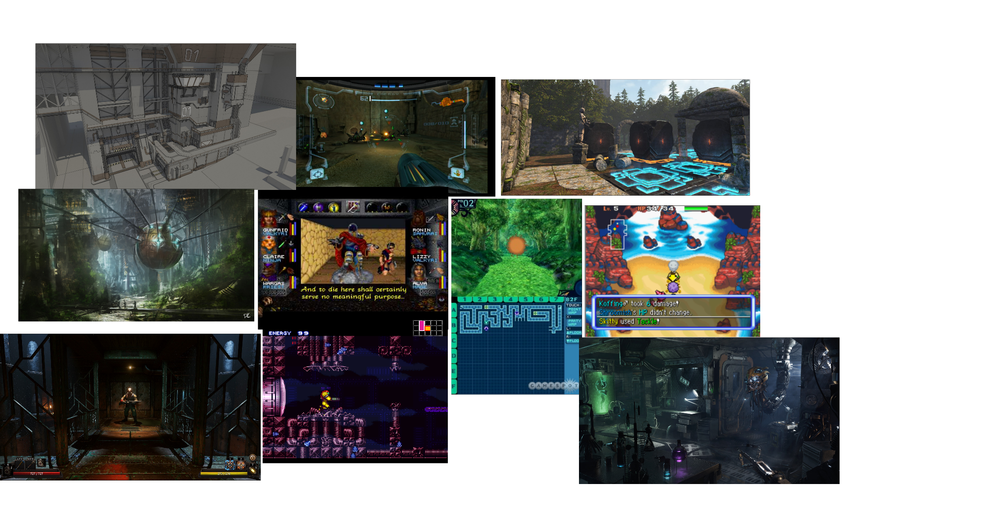

# Inspiration

Games for inspiration:  
Wizardry

Etrian Odyssey

Legend of Grimrock II

Vaporum

Pokémon Mystery Dungeon

Metroid Prime

Super Metroid

It all started with the idea: What if Metroid was a grid-based dungeon crawler?

Metroid: Progression locked behind upgrades, platforming  
Dungeon Crawlers: tactical combat, exploration, grid-based movement, Turn-based / real-time combat

Things I want to learn: Level design, puzzle design, enemy design, UI design

I want to improve my level design skills, so I can create maps that encourage exploration and puzzle-solving

I want to show that gameplay elements of one genre can be applied to another

