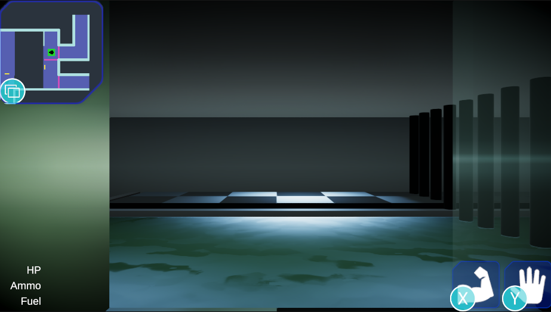

# Design

.png>)

The level for the demo is a part of a water treatment plant on Xoth VI. The design above is an elaboration of the flow graph from the previous log.

The player enters from the bottom left. They receive a comment on how their goal should be straight ahead of them. This was done because quite a few players felt like they didn't have enough guidance at the start, leaving them to wander without direction. This sends them to the small channel. Here they can see the door to the goal on the other side. **Here is the first, and major, lock. **The player does not yet have the means to cross the channel.** **They have walked past another door at this point. That is their next goal.

.png>)

During the play-test, about half of the players went through the door first. Some players like to explore before they go to their goal. This leads to them missing vital information, however. Now they don't know there is a lock for the future key.

The door leads them to a cistern. Right in front of them, is a ladder down. The also can see three platforms ahead, but they can't reach, and a broken wall and a door. One platform has a broken emergency cabinet on it. Another platform leads to a door. If they look closely, they can see a valve underneath that platform. The last platform leads to an alcove and a ladder that can't be reached from the bottom. This leaves only one option: go downstairs.

.png>)

Downstairs, they see various crates and barrels lined up to the side, and the water reaches the player's ankles. The valve ahead is now clearly visible. They can use the valve to raise the water level. If they do, the crates and barrels float upward, creating a path upstairs.

.png>)

.png>)

Following the created path, the player reaches a door. This door leads to a hallway with a glass wall, and a set of stairs. To continue, they can only go up.

.png>)

When the player goes up the stairs, they are met by a bigger channel, and a path on the other side. The channel can be crossed by two ice tiles forming a bridge. On the other side, they find a dead Vernaxx holding a weapon.

.png>)

When the player steps on the ice, it starts to break. If they are still standing on ice when it breaks, they fall down, into the water. They then can take the ladder to their destination. They're now locked into this small space. When they interact with the doors on the side, they learn that they can only be opened from the other side. **This is a similar lock to the one they saw at the first channel, and they've seen a solution.**

The Vernaxx has an Ice Beam with them. **This is the key they need to get out.** Logical deduction, or trial-and-error, teaches the player that they can use this Ice Beam to freeze water and create a path across.

.png>)

If the player returns to the first channel at this point, they'll learn that they're missing another key. The water level isn't high enough. They will need to find another valve. Passing through the Cistern again, they find that the valve is in the alcove. They need to use the Ice Beam to reach it. This valve raises the water in the Small Channel, but lowers it in the Cistern. To leave this spot, they use the half ladder to drop down a level, and the other ladder to get back up. Then they can finally use the Ice Beam to cross the channel and reach their goal.

.png>)

This level design was playtested with a bunch of highschoolers at Night of the Nerds. The feedback was mostly on lack of direction. The layout was confusing to them. I asked them why that was, and their reasoning was that the map wasn't clear and they couldn't see a lot. The range of vision has since been extended.
