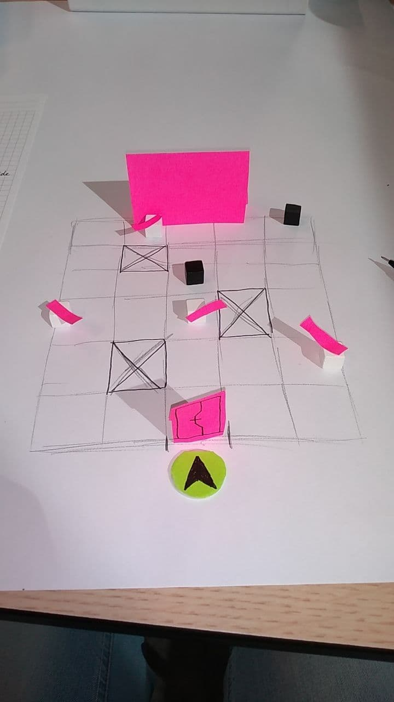

# Paper Prototyping

To test a few practical gameplay ideas, I utilised paper prototyping.

I devised two scenarios, one which involved clever use of the environment to defeat an enemy, and one that is inspired by the Water Temple from The Legend of Zelda: Ocarina of Time.

Okay, "Paper" Prototype. This one was made in Roll20, because it was a day where we worked from home because COVID-19 protocols were still in effect. And because Bart thought the level with the Killer Robot was too simplistic.

What I learnt from these prototypes is that the game doesn't need to focus on combat like an actual dungeon crawler or metroidvania would. A lot of interesting gameplay can be created from interacting with the environment.

But it also taught me that designing levels for the sake of being challenging is not the right way to go. A level, or a part of a level, needs to be designed to the needs of the game. This is still supposed to be a metroidvania, not Portal 2.0. The Reservoir was challenging in the frame I gave it, but not when you would come back during late-game. Each part of a level should also present a goal by itself, and not need a goal given by an extrinsic source.

The paper prototypes showed me that the gameplay I want to create is viable. The turn-based actions, the interactions with moving parts, and the puzzles.

I just need to add proper metroidvania principles to it, so I took the base mechanics from the paper prototypes to a different context. I will discuss these elements in the next chapter.
