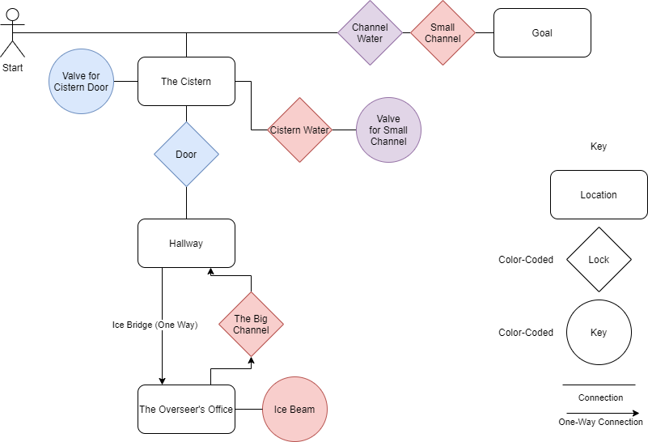

# Complete Level

With the building blocks described in Design, I created the following level graph:

This graph describes the flow of the level. This level represents part of a water treatment plant on Xoth VI. From the graph, I then created the finalised level design on graph paper. The game is grid based, so graph paper is a logical choice.

.png>)

As can be seen from the annotations, I have marked key spots. This is where the points of Anticipation can be found, along with the Locks and Keys. I also marked the spots where a limited form of Environmental Storytelling is used.
